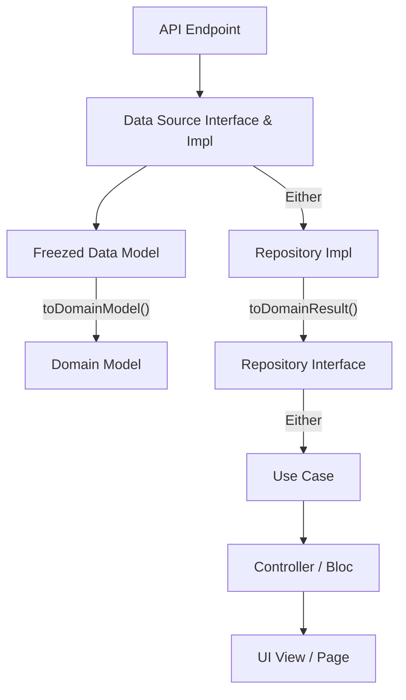

# API Integration Guide

This guide defines the standard architecture, flow, and implementation rules for all API integrations in the application—from data layer to UI.

---

## 1. Architecture & Layer Flow

Every API integration follows a clean architecture flow:



---

## 2. Layer Details & Structure

All features follow this structure:

```
lib/features/{module}/{feature_name}/
```

---

### 2.1 Freezed Data Model

Path:

```
data/models/{model_name}/{model_name}.dart
```

Rules:

* Extends `BaseApiModel<DomainModel>`
* Uses `@freezed`
* Handles JSON serialization
* Converts API → Domain using `toDomainModel()`

```dart
@freezed
class DataModel extends BaseApiModel<DomainModel> with _$DataModel {
  const DataModel._();

  const factory DataModel({
    required int id,
    required String name,
  }) = _DataModel;

  factory DataModel.fromJson(Map<String, dynamic> json) =>
      _$DataModelFromJson(json);

  @override
  DomainModel toDomainModel() {
    return DomainModel(
      id: id,
      name: name,
    );
  }
}
```

---

### 2.2 Domain Model

Path:

```
domain/models/{model_name}.dart
```

Rules:

* Extends `BaseDomainModel`
* Contains business logic only
* Used in UseCases, Controllers, UI

```dart
class DomainModel extends BaseDomainModel {
  final int? id;
  final String? name;

  DomainModel({
    this.id,
    this.name,
  });

  String get displayName => name ?? '';
}
```

---

### 2.3 Data Source (Interface & Implementation)

Path:

```
data/data_sources/
```

Rules:

* Interface defines API contract
* Implementation uses `GenericHttpImpl`
* Returns `Either<Failure, DataModel>`

```dart
abstract class FeatureDataSource {
  Future<Either<Failure, DataModel>> getData(Params params);
}

@Injectable(as: FeatureDataSource)
class FeatureDataSourceImpl extends FeatureDataSource {
  @override
  Future<Either<Failure, DataModel>> getData(Params params) async {
    final model = HttpRequestModel(
      url: params.toQuery(),
      requestMethod: RequestMethod.get,
      responseType: ResType.model,
      responseKey: (data) => data['data'],
      toJsonFunc: (json) => DataModel.fromJson(json),
      refresh: params.refresh,
    );

    return await GenericHttpImpl<DataModel>().call(model);
  }
}
```

---

### 2.4 Repository Layer

Path:

```
domain/repository/
data/repository/
```

Rules:

* Repository exposes ONLY Domain models
* Converts Data → Domain using `toDomainResult()`

```dart
abstract class FeatureRepository {
  Future<Either<Failure, DomainModel>> getData(Params params);
}

@Injectable(as: FeatureRepository)
class FeatureRepositoryImpl extends FeatureRepository with ModelToDomain {
  final dataSource = getIt<FeatureDataSource>();

  @override
  Future<Either<Failure, DomainModel>> getData(Params params) async {
    final result = await dataSource.getData(params);
    return toDomainResult(result);
  }
}
```

---

### 2.5 Use Case Layer

Path:

```
domain/use_cases/
```

```dart
class GetData implements UseCase<DomainModel, Params> {
  @override
  Future<DomainModel> call(Params params) async {
    final result = await getIt<FeatureRepository>().getData(params);

    return result.fold(
      (failure) => DomainModel(),
      (data) => data,
    );
  }
}
```

---

### 2.6 Controller Layer

```dart
class FeatureController {
  FeatureController() {
    fetchData();
  }

  Future<void> fetchData({bool refresh = true}) async {
    await getIt<FeatureHelper>().fetchData(refresh: refresh);
  }
}
```

---

## 3. API Call Guidelines

---

### 3.1 GET API

```dart
HttpRequestModel(
  url: ApiNames.endpoint,
  requestMethod: RequestMethod.get,
  responseType: ResType.model,
  responseKey: (data) => data['data'],
  toJsonFunc: (json) => DataModel.fromJson(json),
);
```

---

### 3.2 GET with Query Params

```dart
HttpRequestModel(
  url: ApiNames.endpoint + params.queryParams(),
  requestMethod: RequestMethod.get,
  responseType: ResType.model,
  responseKey: (data) => data['data'],
  toJsonFunc: (json) => DataModel.fromJson(json),
);
```

---

### 3.3 GET with Body

```dart
HttpRequestModel(
  url: ApiNames.endpoint,
  requestMethod: RequestMethod.get,
  requestBody: params.toJson(),
  responseType: ResType.model,
  responseKey: (data) => data['data'],
  toJsonFunc: (json) => DataModel.fromJson(json),
);
```

---

### 3.4 POST API

```dart
HttpRequestModel(
  url: ApiNames.endpoint,
  requestMethod: RequestMethod.post,
  responseType: ResType.model,
  responseKey: (data) => data['data'],
  showLoader: true,
  toJsonFunc: (json) => DataModel.fromJson(json),
);
```

---

### 3.5 POST with Query Params

```dart
HttpRequestModel(
  url: ApiNames.endpoint + params.queryParams(),
  requestMethod: RequestMethod.post,
  responseType: ResType.model,
  responseKey: (data) => data['data'],
  showLoader: true,
  toJsonFunc: (json) => DataModel.fromJson(json),
);
```

---

### 3.6 POST with Body

```dart
HttpRequestModel(
  url: ApiNames.endpoint,
  requestMethod: RequestMethod.post,
  requestBody: params.toJson(),
  responseType: ResType.model,
  responseKey: (data) => data['data'],
  showLoader: true,
  toJsonFunc: (json) => DataModel.fromJson(json),
);
```

---

## 4. Pagination Pattern

Use only when API explicitly supports pagination.

---

### Data Source

```dart
Future<Either<Failure, List<DataModel>>> getItems(
  PaginateParams params,
) async {
  final model = HttpRequestModel(
    url: ApiNames.endpoint,
    requestMethod: RequestMethod.get,
    responseType: ResType.list,
    responseKey: (data) => data['data']['items'],
    requestBody: params.toJson(),
    toJsonFunc: (json) => List<DataModel>.from(
      json.map((e) => DataModel.fromJson(e)),
    ),
  );

  return await GenericHttpImpl<List<DataModel>>().call(model);
}
```

---

### Controller (Pagination)

```dart
final PagingController<int, DomainModel> pagingController =
    PagingController(firstPageKey: 1);

FeatureController() {
  fetchPage(1);

  pagingController.addPageRequestListener((page) {
    fetchPage(page);
  });
}

Future<void> fetchPage(int page, {bool refresh = true}) async {
  final params = PaginateParams(
    currentPage: page,
    refresh: refresh,
  );

  final result = await getIt<FeatureRepository>().getItems(params);

  result.fold(
    (error) => pagingController.error = error,
    (data) {
      final isLastPage =
          (data.length < AppConstants.paginationLimit);

      if (page == 1) pagingController.itemList = [];

      if (isLastPage) {
        pagingController.appendLastPage(data);
      } else {
        pagingController.appendPage(data, page + 1);
      }
    },
  );
}
```

---

### UI

```dart
PagedListView<int, DomainModel>(
  pagingController: controller.pagingController,
  builderDelegate: PagedChildBuilderDelegate<DomainModel>(
    itemBuilder: (context, item, index) => ItemWidget(item: item),
  ),
);
```

---

## 5. Key Rules

* Always follow existing feature structure.
* Reuse existing files instead of duplicating.
* Data layer → Domain layer mapping is mandatory.
* Repository must NEVER expose data models.
* Always use `toDomainResult()` helpers.
* Use shimmers for loading states.
* Ask before implementing POST body vs query params if unclear.
* Follow pagination pattern only when explicitly required.
